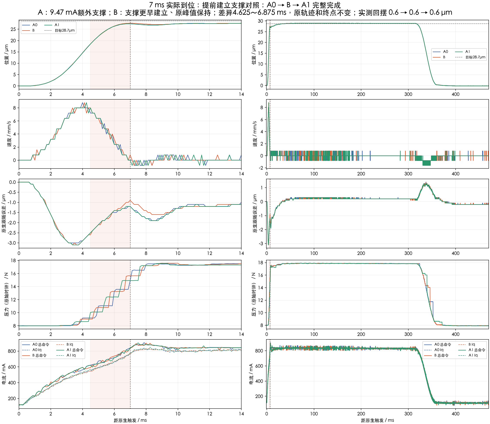
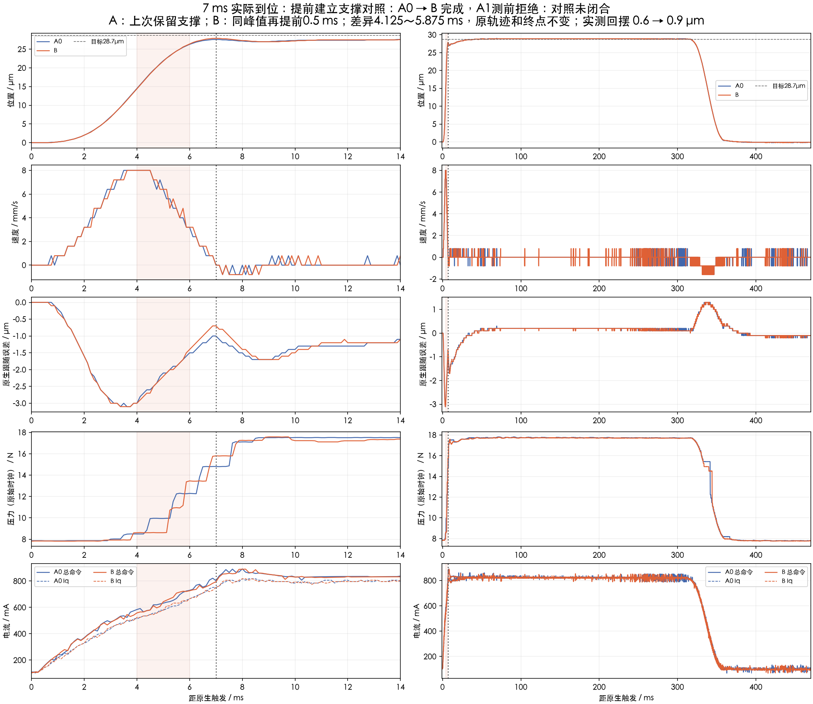

# 从40拍试验到7 ms实际到位：本次调优对话与实验复盘

**整理日期：2026年9月18日｜范围：本次聊天中的目标、决策、实测与未解决问题**

本文主体覆盖9月16日至18日的对话与试验，并补充9月15日7 ms基准的来历。

本轮得到过小幅有效改善，但还没有解决准时到位。较可信的一次完整对照，把7 ms实际欠位从1.3 µm降到1.0 µm，回摆保持0.6 µm；再次提前支撑后，局部多走的0.3 µm又退了回来。后者缺少最后一次基准复测，不能认证完整对照收益。

**当前保留上一档配方；停止继续单独提前支撑的扫描。下一研究方向是末段参考收速与前馈支撑的协调，目标仍是实际走够，而不只是曲线某一刻更接近目标。**

本文是按聊天与实验档案整理的决策复盘，保留关键用户意图和结果。它不是逐字聊天导出，也不是一份新的实机试验；本次文档发布没有连接控制器或发起运动。早期30 µm方案与后期28.7 µm目标属于不同阶段，不能直接拼成同目标改善率。

## 1. 一开始想验证什么

最初需求很直接：做一条40拍位移表，前10拍递增加速，中间20拍恒定步长，后10拍递减，并给出五类曲线。

|区段|每拍位移|合计|
|---|---|---:|
|前10拍|0.05、0.15、…、0.95 µm|5 µm|
|中间20拍|每拍1 µm|20 µm|
|后10拍|0.95、0.85、…、0.05 µm|5 µm|
|全段|40拍|30 µm|

在当时8 kHz采样条件下，40拍对应5 ms。最初入口仍绑定旧7 ms配方，又有测前时序问题，因此需要先适配并验证执行入口。用户允许修改，并明确希望先把真实数据跑出来。

这条40拍轨迹后来确实实测：5 ms实际压入28.8 µm，仍有3.2 mm/s向下速度；首峰29.2 µm@5.375 ms，首谷26.9 µm@7.5 ms，回摆2.3 µm。原始F5约13.345 N。该条原生COMPLETE并有16000行数据，但运动后证明检查失败、主机ACK未成立，外层组仍为FAILED。真实运动完成与完整会话通过必须分别记录。

五类曲线贯穿后续工作：**位置、速度、误差、压力、电流**。原生跟随误差与同一记录行的“新参考−实际位置”不是可直接互换的量；原始压力时间也不应为使曲线好看而平移。

## 2. 先摸加速能力：能多快拉到多高

随后关注点变为：知道实际速度以后，能否及时收速，把摆动控制住。于是先进行加速能力探索，再测试前馈能否缩短提速时间。

七条加速能力记录完成后，在参考12 mm/s的探索档中，实际首次达到8 mm/s约1.5 ms，连续三拍确认约1.75 ms；首次达到12 mm/s约2.25 ms，观测峰值12.8 mm/s。代价是约4.0 µm回摆，峰值还发生在参考已经开始减速之后。

这证明“速度能够拉起来”，没有证明“能够在相同目标处及时停住”。各档参考终点、减速时间及起点条件有所不同，它们用于能力观察，不能当成严格单变量优劣排序。

接着在固定参考上加入前段助推：

|输入变化|观察结果|证据边界|
|---|---|---|
|额外20 mA助推|达到6 mm/s提前一拍；达到8 mm/s时间不变|后基准未完成，不能认定可重复改善|
|额外40 mA助推|达到6 mm/s提前两拍；达到8 mm/s时间仍不变|起点有差异，后基准未完成|

这里已经出现一个后来反复出现的特征：**某个局部指标提前了，最终关心的指标却没有同步改善。**

## 3. 8 mm/s触发制动：澄清“40 mA”的含义

用户提出：用UDSX根据实测速度规划，达到8 mm/s开始减速，在5 ms尺度内收速，并观察回摆。随后明确：

> 40 mA是额外叠加的反向前馈。

这一定义很关键。按当时方向约定，反向修正会减少原有下压输出，但它不表示总电流已经变成反向40 mA。位置闭环、已有前馈和积分等仍共同决定总输出。

聊天中对一张试验图的分析，曾估读出“约8 mm/s触发后继续升至约9.6 mm/s”“反向前馈约0.5 ms建立”“新参考终点约25 µm”等现象。这些是当时图上估读，不是第二次独立实测。后来的原始记录审计进一步确认：1.750 ms触发时，新参考12.0 µm、实际6.1 µm，同排差5.9 µm，而原生FE为−4.2 µm；2.250～2.625 ms连续四拍速度9.6 mm/s，2.750 ms首次降到8.8 mm/s。自由终点试验的5 ms实际位移23.2 µm、速度−0.8 mm/s，首峰23.5→首谷21.6 µm，回摆1.9 µm；新参考终点25 µm，原29 µm载体终点未保留。

执行路径审计确认AP/AV与显式FF成功写入，并有持续读回；但切换段仍缺少控制后实际采用P/V的同相采集，也没有单独隔离40 mA对总命令和Iq的贡献。于是需要核查：

1. 新请求的位置、速度和前馈，是否真正进入控制器，并且来自同一条规划？
2. 输入变化后，总命令、Iq和实际速度分别从什么时候开始变化？
3. 提前减速时，是否悄悄减少了参考总位移？

“参考开始下降”和“实际加速度已经转负”必须分开看。达到8 mm/s才触发，也不等于把实际峰值限制为8 mm/s。早期接口探针、未派发候选和正式高速试验分开留档，没有以软件逻辑启动或静态探针成功代替机械效果。

## 4. 控制路线收敛：保留原生闭环

用户最终明确主方案：

> 原生闭环不撤，整段参考与前馈一起优化，主要靠动作间的受约束学习把配方做对，再用UDSX处理本次的小偏差。

这使工作重点从不断增加控制方法，转为沿一条路径建立证据。极端起速再刹车、固定8 mm/s触发、继续加大末段40 mA、压缩旧电流波形，以及未经辨识的新高增益Iq外环，都没有成为主线。

调优目标逐步明确为三件事：**走够、收速、接住负载。** 电流曲线形状和峰值速度是实现目标的手段。真正要学习的是“某一段输入怎样影响后面的实际位置和速度”，而不是把每拍误差简单取反加回去。

## 5. 为什么试验过程耗时：机械动作与执行问题分开

用户多次要求加快实验，也追问是否是修改UDSX造成超时。档案中确实出现过软件和流程问题，但它们不是同一种失败。

|问题类别|当时意味着什么|应如何记账|
|---|---|---|
|测前115 µs门拒绝|尚未允许新的快速运动|记录真实测前行，不能算候选机械失败|
|真实SAMPLE_OVERRUN|原生采样故障|保留错误与恢复证据，不与门拒绝混称|
|主机审阅交接150秒超时|预运行已完成，主机未及时交接，组关闭|属于主机流程责任，不能归咎机械或UDSX采样|
|起点压力／电流不匹配|条件不足以继续本组对照|没有发生的动作不补算，失败组不重开|
|事后性能诊断未通过|动作可能已经正常完成|保留真实曲线，区分性能结论与保护故障|

起点恢复也单独留档：AI在连接阶段拒绝、AJ因初始压力和电流拒绝，都没有快速候选数据；其后两次各1 µm低速卸载用于恢复起点，不能计作候选ABA成员。用户确认未调整夹具或施加外力，压力变化的根因仍未得到唯一解释。

软件工作包括绑定校验、计时观测、ACK持久化时机以及逐条审阅衔接。延后ACK写盘的两个独立测前入口曾观察到84.663和86.571 µs峰值，低于原115 µs门；这支持改善启动负担的方向，**不等于已经证明旧超时的唯一根因，也不等于最坏执行时间认证**。

后续每条先采集、核对和评分，再审阅下一条。提前安排独立审阅者缩短了交接等待，但一次完整组仍要花数分钟；这些墙钟时间不能当成机械响应延迟。主机侧流程问题也不应通过增加电流来解决。

## 6. 7 ms阶段：支撑更早有局部价值，加量并非持续有效

7 ms基准来自更早的8→7 ms缩时与末段支撑试验。9月15日，20 mA支撑在完整对照中改善过局部位置，但旧全指标评价因电流形状诊断未过而失败；用户后来采纳位置作用，旧评分并未改写。20→30 mA有小幅同组收益，30→40 mA则首谷与回摆都没有改善，推动后续转向作用时机。

后期比较主要围绕7 ms、28.7 µm原目标展开。通常安排P/A0/B/A1：P是预运行，不进入收益评分；A0和A1是前后基准，B是候选。只有同组对照才能估计重复差异，不能把不同组较差的A与较好的B拼成收益。

以下按决策顺序选取代表性阶段。表内数字均属于对应组，不表示跨组累计改善。

|阶段|改了什么|本组主要结果|当时结论|
|---|---|---|---|
|G/H：前中段助推|2～5 ms加5或10 mA|局部x7至多约0.1 µm，回摆增大|未保留，更多表现为抬峰|
|J/M：原30 mA移时|整体提前0.5或0.75 ms|两组各自获得局部位置与回摆收益|分别保留，未直接证明0.75优于0.5 ms|
|O：同窗继续加量|30增至35 mA|x7与回摆无可分辨新收益|未保留|
|T：中段进度|增加0.5 µm参考进度再退出|4/5 ms优势约0.54/0.44 µm，到6.5 ms消失|完整对照未保留|
|U：延后进度退出|平台延至5 ms，6.875 ms退完|首谷相同，B回摆0.9、前A0.8 µm|B已执行，后A时序拒绝，未形成完整结论|
|V：延长晚支撑|原30 mA峰后增加1 ms平台|A0/B/A1首谷均26.2 µm、回摆均0.7 µm|首谷与回摆无收益，较晚位置有局部响应|
|Y：半幅增量提前|额外约9.47 mA支撑增量提前作用|回摆0.8→0.6→0.8 µm；首谷26.2→26.5→26.2 µm|本组通过原严格收益门，保留候选|
|Z：原样复验|重复同一候选|回摆0.7→0.6→0.7 µm|仅0.1 µm改善，未过原严格门；不抹去Y结果|
|AA：增量加20%|约9.47增至11.36 mA|回摆0.7→0.5→0.8 µm|相对该组原基准通过；不能证明比9.47更好|
|AB：直接比两档|9.47对11.36 mA|x7均27.1 µm，首谷均26.5 µm|加量未确认到位收益，继续以9.47档比较|
|AH：中段进度提前|中段增加0.5 µm参考进度，后面退回原终点|中段优势到7 ms仅约0.05 µm；回摆0.6→0.8→0.6 µm|不保留候选|

这些结果逐渐约束了方向：晚加支撑可能来不及抬起首谷；更多支撑并不保证更多终端位移；中段追得更快，也可能在参考增量退出时失去优势。

不能据此断言前馈无效。它确实改变了部分位置响应，但**局部有效、重复可靠、最终任务完成，是三种不同强度的结论**。

## 7. 最重要的一次目标澄清：0.6 µm回摆已经够了

用户明确指出：

> 现在不是回摆的问题，0.6微米已经可以了，问题出在不能走到最终位置。

从这里起，主指标转为固定时刻的实际欠位和实际到位时间。回摆作为保持在可接受范围的条件，不再要求每轮继续减小。

原始位置记录也澄清了一点：机构后续能够走到目标附近，问题主要是快段结束时还没走够，随后慢慢追上。不能把“7 ms未到位”说成“最终一直到不了”，也不能用后面终于到位来替代7 ms目标。

评分优先级在新组开始前调整，旧组结果保持，不通过改写旧门槛制造成功。

## 8. 上一次认可的结果：确有0.3 µm改善，但没有明显缩短到位

AK组保持全部参考轨迹、原目标与闭环增益，只让原峰值支撑更早建立。它完成了P/A0/B/A1完整对照。

|指标|A0|B：提前建立支撑|A1|
|---|---:|---:|---:|
|7 ms实际位移 / µm|27.4|27.7|27.4|
|距28.7 µm目标欠位 / µm|1.3|1.0|1.3|
|首谷位置 / µm|26.8|27.1|26.8|
|回摆 / µm|0.6|0.6|0.6|
|首次量化触及目标 / ms|30.5|30.75|31.125|

本组7 ms欠位减少0.3 µm，首谷也提高0.3 µm，回摆保持0.6 µm。按事先定义的位置优先规则保留了候选。部分晚窗电流形状诊断未通过，原结果照实保留；候选保留没有被描述成所有指标通过或生产默认更新。

这次改善是真实的同组证据，仍然有限：B还欠1.0 µm，首次触及目标没有明显提前，9.5～10 ms附近的局部位置优势已经消退。首次触及只是编码器采样第一次到达该值，不是稳定到位时间。

[打开AK末段位置细节](assets/ak-rebound-detail.png)

## 9. 再提前0.5 ms：增加的行程退了回来

用户认可AK后，AL以AK/B为新基准。B保持35.33421 mA残余支撑峰值，将建立过程再提前0.5 ms；实际输入差异集中在4.125～5.875 ms，6 ms以后与基准一致。峰值不变，但支撑面积增加，不能称作等面积平移。

|指标|A0：上次认可配方|B：再提前0.5 ms|
|---|---:|---:|
|7 ms实际位移 / µm|27.6|27.9|
|距28.7 µm目标欠位 / µm|1.1|0.8|
|首峰位置 / µm|27.6|27.9|
|首谷位置 / µm|27.0|27.0|
|回摆 / µm|0.6|0.9|
|首次量化触及目标 / ms|32.5|37.375|

候选在7 ms多走0.3 µm，回摆也多0.3 µm，首谷没有提高。9 ms时差值归零，15和20 ms两条位置相同。现有观察不支持把它当成整体到位改善。

本组最后A1在动作前因压力7.793206 N低于原7.8 N下限被拒，仅有两条普通比较读数，未发生第四次快速运动。P/A0/B已完成的真实记录全部保留；缺后A，不能认证完整对照收益，也不能把到位时间变长唯一归因于候选。

此次不是115 µs时序门拒绝或SAMPLE_OVERRUN。组已关闭，不自动重试，不借P或旧组A补齐。**不新增保留候选，AK原结论不变。**

[打开AL局部输入—位置差](assets/al-local-response.png) · [打开AL末段位置细节](assets/al-rebound-detail.png) · [查看A1准入拒绝读数](assets/al-match-rejection.png)

## 10. 为什么这个方向没有带来更大的提升

**第一，优化对象太局部。** 早期以提速门槛、回摆或某一时刻位置为着眼点，出现过局部指标改善、最终到位不变的情况。后期目标虽已转向到位，实际改动仍主要集中在一段支撑时机。

**第二，新增进度未能贯穿末段。** 中段参考进度试验在退出时失去优势；本次提前支撑把峰值抬高，首谷却没有提高。数据约束的是“优势保不住”，还不能唯一判定是某个PID分量、机械参数或固定延迟造成。

**第三，加量与提前的收益不能线性外推。** 两档支撑直接比较没有确认进一步收益；一次多走0.3 µm，不意味着按比例加量就能补齐剩余1 µm。

**第四，重复性和起点会影响很小的收益。** 多轮只有0.1 µm量级差异；对照缺后A，或预压力、初始电流变化时，更不能把全部差值归于新输入。用户确认没有调整夹具或施加外力，仍不足以唯一解释固定显示位置下压力变化的原因。

**第五，流程投入没有始终转化为机械进步。** 时序和记录可靠性工作是必要基础；但多轮小幅支撑试探得到的主要是局部响应信息。后续不应继续用“再加一点、再提前一点”替代终端状态设计。

## 11. 当前保留什么，下一步做什么

当前保留AK认可档作为比较基准，保留原生位置闭环、28.7 µm目标和现有主保护。0.6 µm回摆是用户接受的表现；7 ms实际到位和最终5 ms目标都尚未完成。

下一研究集中在6～9 ms：让位置／速度参考的收速过程与前馈支撑退出一起设计，用少量平滑参数形成可解释候选。需同时检查：7 ms实际欠位是否减少、改善是否在首谷后仍存在、实际到位是否提前，以及保持与返回是否正常。

已经失败的“中段多走再退回”和“单纯延长晚支撑”要作为约束证据，不能换一个名称再试同一思路。先离线核对同源参考与全部电流预算，再做有前后基准的有限对照。UDSX的小偏差修正应建立在验证过的输入响应关系上；当前动态模型与在线修正尚未获得性能资格。

下一候选截至本文尚未生成、冻结、上传或排队。没有证据保证这一方向必然达到7 ms或5 ms，也不能据当前局部尝试断言硬件已经到极限。

## 12. 如何使用这份复盘

- **看目标变化**：30 µm／40拍、速度能力、制动与后期28.7 µm／7 ms是不同阶段。
- **看同组结果**：表内A0/B/A1按原组比较，不跨组累计收益。
- **看三层状态**：软件执行正确、机械局部响应、最终目标达成分别判断。
- **看时间定义**：原生采样时刻、首次量化触及、持续稳定到位、主机耗时分别记账。
- **看证据完整性**：没有执行的候选没有实测结论；正常完成后被事后评分停止的记录也必须保留。

本页公开选定曲线与脱敏摘要；逐拍原流、配置恢复、失败日志和完整审计保留在本地实验档案。公开摘要中的阶段名称和文件哈希用于追溯，不冒充可在线访问的原始记录。

[下载本文Markdown](report.md) · [下载关键结果CSV](key-results.csv) · [下载公开证据索引](evidence.json) · [返回报告首页](../../)
