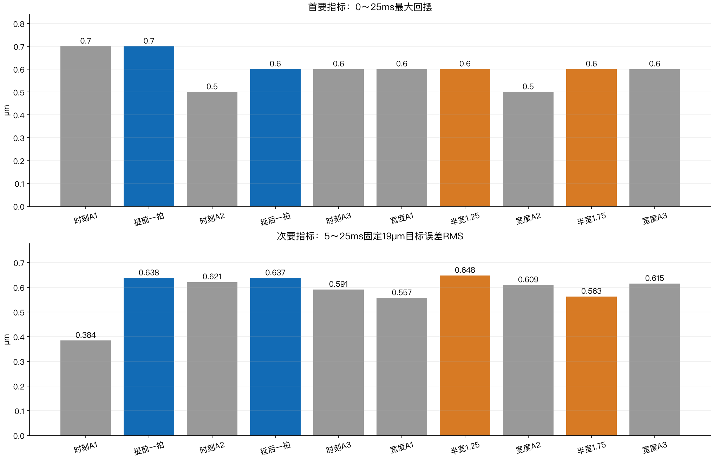

# NYCE 5 ms：调优经验与逐拍参数路线

2026-09-11更新。本文复核聊天中的目标与决策、15组历史阶段、官方V54文档、SDK及恢复的PFC逻辑。**本轮没有新增轴运动、没有改轴参数、没有部署增益表。** 文档与skill整理完成后，再按证据推进实现和有限对照。

## 现在该怎么走

**保留目前H48位置和FF基准，优先开发一条跨越到位前后、平滑升降的KV曲线。验证它之后再研究KP；KI暂时固定。** 同时借鉴PFC的“力误差转运动参考修正”思路，但不把未确认延迟的力反馈直接接入前5 ms高带宽闭环。

当前2→8 N、19 µm、40拍5 ms到位参考、100拍12.5 ms表，试验期间整段临时KV=.0005，每次退出恢复0。最近六条H48对照回摆.7/.5/.6/.6/.5/.6 µm；四个H脉冲时刻/宽度候选均没有继续降低回摆。加宽后的RMS改善约8%，但回摆仍.6 µm，因此没有换掉原版。

**路线仍有可研究的自由度，尚不能保证新的KV曲线会进一步改善。** 旧工况KV.0005→.001→.0005得到1.3→1.0→1.3 µm，支持KV作用；同时保持命令电流标准差从约10.7增到21.6 mA。旧结果不能按比例外推到当前H48。



[查看十次位置与回摆曲线](images/H48-position.png)

## 经验：哪些做法有用，哪些结论不能直接下

| 做法 | 历史观察 | 留下的经验 |
|---|---|---|
| 瞬间给静态电流 | 力可快速上升，5→10 N曾峰值约12.95 N、持续入带约29.875 ms | 电流命令快不等于接触力已稳定；保持推力与运动惯性要同时处理 |
| 前快后慢/更平滑参考 | 首峰略低，回摆未必下降；四阶研究并非硬件已成功 | 参考的v/a归零不能代替实际机构停稳 |
| 40→100拍恒位延长 | 兼容与动作完成得到验证，延长本身未确认减振 | 第40拍后控制并未消失；后60拍要改变有效输入才可能改变响应 |
| 尾段多压一点 | 共同目标谷值提高，但按各自最终目标的最大欠量几乎不变 | 固定目标和绝对欠跟一起报，不能用移动终点制造减振 |
| 平滑位置/FF学习 | 一些独立对照有收益，继续放大不一定更好 | 用小扰动识别跨拍影响；不要把历史误差逐点取反硬加 |
| 同5 ms普通PTP | 零FF版本2.125 ms就触发原生FE；完整参考未执行完 | 只说明当时零FF反馈跟不上，不证明PTP算法先天不可行 |
| 将2→23缩为2→8 N | 预测峰谷约2.98 µm，实测2.6 µm；首峰未同比缩小 | 缩幅改善回摆，但行程、速度、加速度同时变化，非单变量归因 |
| 整段拉到12.5 ms | 最大退回约.1 µm，但结束时欠约1.2 µm | 时标敏感，不证明传感器无关，也不算5 ms达标 |
| KV增大 | 有减回摆收益，保持命令噪声增加 | 分阶段增益值得研究，不能无限加大常量KV |
| 夹具变化后重测静态关系 | 19 µm/FF23重匹配后回程恢复，随后还有噪声筛查问题 | 先匹配负载，再调动态；回程失败不靠放宽结束条件解决 |
| H48四种时刻/宽度微调 | 全部完成但无回摆升级，两次.5 µm属原版 | 保留全部A，单次最小值不等于稳定提升或物理极限 |

完整条件、计数、失败分类和源文件见[15组历史经验](history.md)。不把不同夹具、不同预压、不同力目标下的数字拼成严格的因果曲线。

## 可以放进每拍的参数

“支持快速写入”“当前已实现”“本机已验证”是三个不同层次。表预装到控制器，125 µs的实时执行由UDSX完成；网页负责编辑、预览和下发。

| 参数/通道 | 能力与现状 | 建议 |
|---|---|---|
| 位置P、节点速度V | 当前已执行40/100表；由缓冲样条生成参考 | 保留主轨迹；必要时用少量平滑位置修正，P/V/派生FF一起重算 |
| 附加FF | 官方fast；当前已逐拍写入并实测 | 保留成熟通道，KV确定后再联合优化E/H或模型残差 |
| KV | 官方fast；当前只有整次常量实测 | **第一新增通道**：到位前逐步增强，覆盖首次回摆，随后平滑降低 |
| KP | 官方fast；当前固定 | **第二阶段**：单独测试末段比例反馈强度，不能默认越大越稳 |
| KI | 官方fast；当前固定 | **先验证状态语义**：不能把KI=0直接当作无扰冻结积分 |
| KFA | 官方fast；原生加速度前馈整段固定 | 可优化惯性补偿；第一轮KV对照固定，避免同时改变两条作用路径 |
| KFV/KFC/KFST | 官方fast；当前原生为0，应用已合成速度/平滑摩擦/负载FF | 许多作用已能写进FF表，无须为了更多参数重复补偿 |
| KFJ/KFSNAP | 官方fast；当前为0，未本机调度实测 | 有模型证据再考虑；分段高阶导数及接缝必须处理 |
| ADDITIVE_POS/VEL | 官方fast；现有守护要求0 | 可借鉴参考修正，但要统一轨迹、运动范围和前馈；不能直接旁路叠加 |
| LLF、微分估计、LPF/notch | 不在官方fast清单；可按整次配置研究 | 单独考虑噪声和相位；不能声称加滤波没有延迟代价 |
| standstill增益调度 | 配置本身无fast；按SPG参考速度动态生成有效增益 | 可研究，但不能凭它区分同为零参考速度的回摆窗口和长期保持 |
| PFC_KP、力反馈源 | PFC_KP没有fast标记；力输入/源选择有fast支持 | 外层力误差到每拍参考增量，见下一节；不是每拍PID自整定 |
| 电流PI、保护、开环、限幅 | 部分也支持fast | 不作为本轮回摆调优自由度 |

**不要把一张40拍表变成40×十几种互相独立的旋钮。** 先用少量参数生成平滑曲线，逐项辨识后再联合优化。详细单位、源码、已实现状态及PFC底层映射见[参数研究](parameters.md)。

这里还纠正一个历史口径：部分旧报告把“目标以下最大欠量”简称回摆，与近期“在前峰到后谷的最大退回”不是同一指标。因此不能直接用旧5.0 µm与新.6 µm计算统一改善比例。

## 从PFC底层借鉴什么

PFC不是把KP/KI/KV在每拍自动调到最佳。应分别看预先配置的力源、力标定、PFC_KP与运动约束，以及运行时根据力参考和实际力更新的运动参考。恢复代码的版本与当前drive不同，能解释算法思路，不能当成本机drive逐行执行的证明。

PFC原生段包含目标力、爬升时间、保持时间、活动位置范围与力/位置控制标记。当前SDK最多16段；16段不等于16拍，一段可跨很多节点周期。它没有我们40拍位置/FF表的全部字段，也不能直接承诺125 µs一段。

本轮核对SDK变量说明与恢复代码，得到以下运行顺序：

1. 取得所选力反馈：模拟源应用配置的方向、比例和可选平均；软件源直接复制软件力输入到实际力/平均力槽。
2. 按当前段的爬升时间生成目标力，保持段采用该段终点力。
3. 计算 **每拍纠偏位移 Δx=(目标力−平均测量力)×PFC_KP**。
4. 把Δx送到设定值生成器的位移增量路径；恢复分支的参考速度为Δx×节点频率。位置段或位置范围退出会抑制力纠偏，最后段结束产生完成事件。

```text
预装力段 → 本拍目标力 → 力误差 × 固定PFC_KP → 每拍位置增量 → 位置伺服
                              ↑                         ↓
                          测量力反馈 ← 电机与接触机构
```

**它调整的主要是力参考、位置增量和相应速度，不是每拍重整定KP/KI/KV。** PFC_KP是在准备时配置、运行分支读取的外层增益；它与普通位置KP不同，也没有普通KP那样的fast标记。

这里有两个不能直接照搬的地方。第一，Δx是每拍位移增量，不是每拍都相对固定终点加一次绝对偏移；持续力误差可能累计成持续运动，需要累计位移与每拍速度边界。第二，恢复分支的加速度和jerk参考槽写0，不表示真实运动没有加速度，也不等于当前平滑样条的高阶连续性。不能把这条路径直接叠加到现有P/V/FF上而不重算。

可借鉴的是**按阶段推进、参考与反馈分层、修正范围和退出规则**。我们先让KV按到位/回摆/保持阶段变化；以后再研究受限力误差外环。该外环必须先确认测力更新与延迟，不能靠把记录时间减2.5 ms就获得无延迟反馈。

这些恢复文本属于一个有固定hash的MCU运动程序，并非本机type0 drive的厂商源码。本轮未读取现场固件。它形成的是后续SPG参考，不能解释成测力、增益、电流和机械同拍无延迟生效。精确函数、变量映射和版本界限见[参数研究中的PFC运行时映射](parameters.md)。

## 下一轮应怎样设计

1. **实现和验证KV表，先不动KP/KI/FF。** 表覆盖前40拍及后60拍。用开始时刻、增强幅度、维持时长、回落时长生成平滑曲线；长时间保持回到较低水平。具体数值在实现、预算和读回时序验证后冻结。
2. **用当前H48作相邻基准。** 先做常量表等价性，再做有限A–B–A；实测能分辨减回摆后才重复确认。现有LLF、微分估计、主位置、FF、起点与原保护保持。
3. **固定KV后再辨识KP。** 非零位置误差时改变KP会改变输出，且与积分支路耦合；记录原生FE、实际位置、积分和总命令。先单变量，之后才联合小范围调度。
4. **KI先做状态连续性验证。** 观察改变前后积分输出与有效I增益，核实保留/缩放/复位以及恢复行为；证据不足时维持33.432975。
5. **再考虑PFC式低速校正。** 已知时序与数据年龄的力反馈可用于预压重置和后期持力微调；前5 ms先由已匹配的参考/FF与位置反馈承担。前后接管须平滑，不与原生PFC同时争用同一参考。

目标仍是5 ms。后60拍用于抑制到位后的回摆，不用12.5 ms成绩替代5 ms。当前约0.6 µm的剩余回摆是否还能降低，是下一轮待验证的问题。

## 怎么判断是真的改善

主指标是0～25 ms内时间有序的最大退回；同时报告首峰、谷值、目标下欠量、5 ms位置/速度、5～25 ms RMS、第二次摆动与保持电流波动。削峰是可能的收益，但不得把目标欠跟隐藏起来。

原始F5、用户固定2.5 ms假设后的F7.5单点、持续力带分列。最新10次原始F5为0/10，假设单点10/10；这不等于已测出真实延迟或认证真实5 ms持续稳压。0.1 µm编码器格点与0.8 mm/s原生速度格点也限制微小差异的解释。

运动前拒绝、首故障前数据、故障后禁用、原生COMPLETE和事后噪声筛选分别记录。旧停止标记与旧报告不重写，新结果只追加。

## 已固化的skill与下载

本轮建立独立skill **nyce-position-force-tuning**，覆盖40/100拍位置/FF/增益调优、PFC机制边界、故障分类、重复验证、数据保全和公开发布。原Stepper接触PFC skill保持原样，不把另一轴的实验限制直接套到本项目。

- [Skill入口](skill/SKILL.md)
- [完整经验报告Markdown](report.md)
- [15组历史经验](history.md)
- [逐拍参数与PFC研究](parameters.md)
- [当前基准说明](skill/references/current-baseline.md)
- [H48位置与FF参数](H48-profile.json)：不含自动应用临时KV的动作。
- [试验与数据约定](skill/references/experiment-contract.md)
- [参考文献与来源索引](sources.md)

公开材料仅包含选定静态文档和曲线。详细原始采样、控制器登录资料和可执行硬件工具未作为公开附件。
