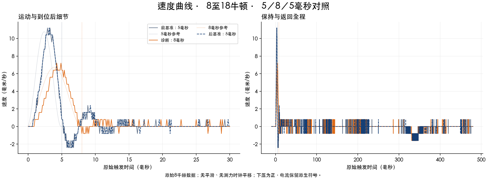
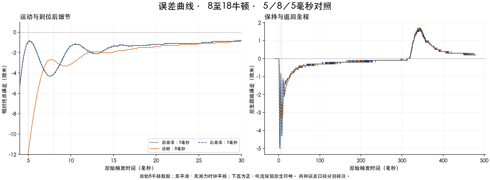
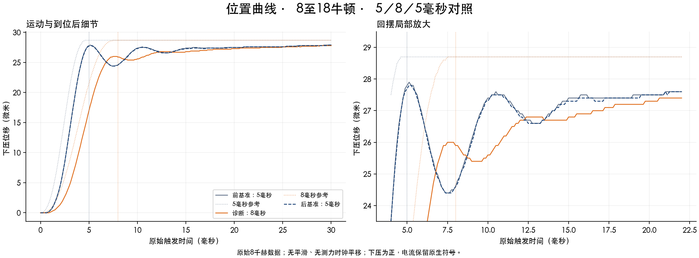
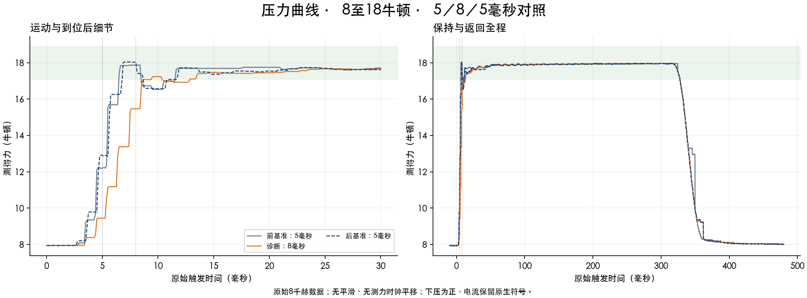
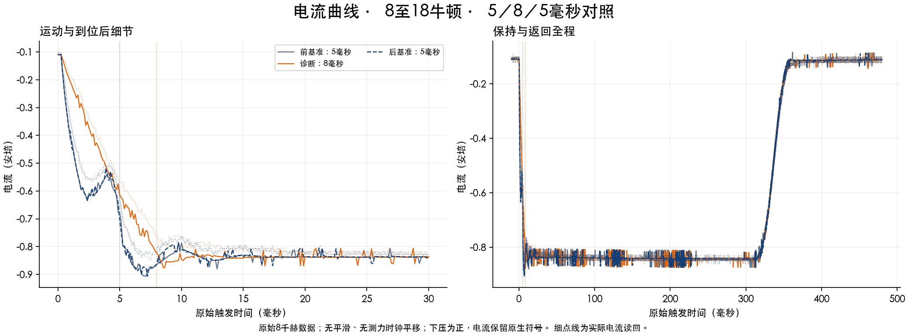

# 8→18 N：完整5／8／5毫秒对照

**本轮找到明显的时标作用，但尚未达到5 ms目标。** 新组回摆3.5／0.6／3.4 µm，前后基准只差0.1 µm。按实际派发时间对两个A作局部线性插值，8 ms回摆减小82.57%。

| 指标 | 前5 ms基准 | 8 ms诊断 | 后5 ms基准 |
|---|---:|---:|---:|
| 运动时间（毫秒） | 5.0 | 8.0 | 5.0 |
| 回摆（微米） | 3.5 | 0.6 | 3.4 |
| 首峰位移（微米） | 27.9 | 26.0 | 27.8 |
| 首谷位移（微米） | 24.4 | 25.4 | 24.4 |
| 各自到位时欠量（微米） | 0.9 | 2.8 | 1.0 |
| 到位后20毫秒误差RMS（微米） | 1.896 | 1.865 | 1.926 |
| 100～300毫秒保持力（牛顿） | 17.939 | 17.933 | 17.931 |
| 原始5毫秒力（牛顿） | 12.203 | 9.434 | 12.891 |
| 各自参考终点原始力（牛顿） | 12.203 | 15.469 | 12.891 |
| 各自终点＋假设2.5毫秒力（牛顿） | 17.872 | 17.007 | 18.047 |

8 ms把首谷从24.4抬到25.4 µm，同时首峰从约27.84降到26.0 µm。回摆的2.84 µm减少中，约1.84 µm来自首峰降低、1.00 µm来自谷值抬升。不能把全部回摆改善称为到位改善。8 ms终点欠2.8 µm；等长到位后20 ms误差RMS只改善2.50%。

数据支持把问题分成快摆动与慢纠偏两部分。8 ms峰值参考加速度约为原来的39%，摆动明显下降，说明减速及到位过程的动态激励是重要因素；这不是已识别唯一的机械共振或滤波器根因。三条记录从动作前到100～300 ms持压期，积分平均分别进一步下压16.62／17.52／17.07 mA，仍有慢纠偏。该均值差用于定位负载前馈标定与交接残差，不是要求直接补某个电流值，更不把旧120 mA算术残差当缺失电流。

下一轮回到5 ms，优先改变前40拍的位置与速度时序，保留后60拍恒位交接。已经保存两条未实测候选：中段进度分别提前0.25／0.50 ms，总时长仍5 ms、行程28.7 µm、原负载/速度/加速度/摩擦前馈与反馈不变。首末Hermite段保留，393字段原生纯解析与142段连续预算通过，条件电流预算均0.960854 A。峰值加速度分别增至8929／11680 mm/s²，所以时序前移也可能增大激励；它们是待辨识候选，不是已证明的改进或测得的延迟补偿。优先评估较小的0.25 ms版本；同时核实持压前馈偏差，实际终点、速度、首峰/首谷及误差要一起改善。

新组3次请求／3次原生COMPLETE／48000条真实8 kHz记录，均完成返回、健康检查与KV/actualD恢复。此前本轮另有2次原生COMPLETE／32000条记录：第二条在动作完成后，被旧审计器固定[5,25]评分窗误拦。原关闭状态和失败审核保存；修正副本使用真实记录通过复核。新组全部重新采集，不拼接旧基准。本轮合计5次真实快动作、80000行；0慢动作、0新轴故障、0Reset/Lock/Home/服务重启/新原生上传。

主机审核修复：评分窗必须与真实P/V终点一致，40拍对应[5,25]，64拍对应[8,28]，力容差仍5%。新增真实审核回归4项，评分/流程/初始参考检查31项。新组把最早一次重复183项读取合并到网页暂停后的最后一次完整校验，每条4个SDK连接；137配置、fresh、原生保护、返回与恢复检查保留。

原始F5、用户假设2.5 ms延迟的单点、持续持压分开报告。A5的假设单点虽约18 N，之后仍出现下降；不等于5 ms持续稳压。8 ms诊断也不作为5 ms达标。原始时钟不平移。

实际派发间隔130.042／94.960 s，未要求180 s固定周期。局部线性漂移插值只用于本组，单次B仍不构成生产重复性认证。服务最后记录为15线程，只读VmSize260252 KiB，距原256 MiB门槛仅1892 KiB；厂商连接线程泄漏没有修复，下一次实测前须先解决连接资源余量，不提高门槛。

实验结束时保存的历史状态（2026-09-13T01:21:33.993930+08:00）：READY，rawSP/actual −0.0057 mm，origin＋0.0004 mm，约7.954 N，KV/actualD/UDSX/USER7均已恢复0，两组关闭，无排队。

[结果JSON](results.json) · [结果CSV](results.csv) · [新5ms候选与验证](next5ms-design/proposed-design.json) · 原组审计修正证据保存在实验档案

[下载速度曲线 PDF](plots/速度曲线.pdf)

[下载误差曲线 PDF](plots/误差曲线.pdf)

[下载位置曲线 PDF](plots/位置曲线.pdf)

[下载压力曲线 PDF](plots/压力曲线.pdf)

[下载电流曲线 PDF](plots/电流曲线.pdf)

公开文件来源与SHA-256见[发布文件清单](manifest.json)。原始记录和完整审核证据保存在实验档案。
