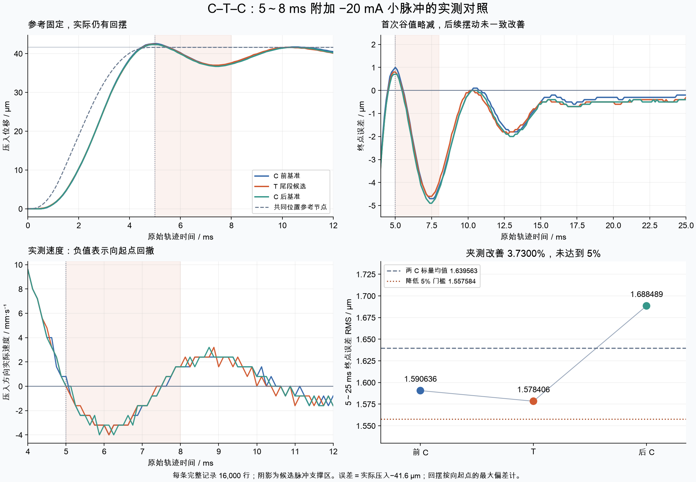
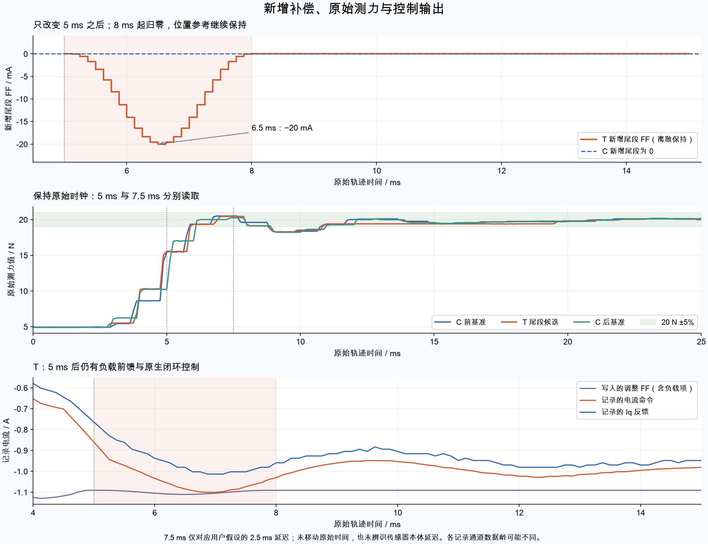

# 尾段小补偿未确认整体改善 · C–T–C 实测报告

2026-09-09 · 5 → 20 N / 41.6 µm

## 结果：保留 C，本轮不追加确认

三个快测均 COMPLETE、每条 16,000 行，无运动故障。T 的 5～25 ms 终点误差 RMS 为 **1.578406 µm**，前后 C 的标量均值为 **1.639563 µm**，改善 **3.7300%**，低于冻结的 5% 门槛。两次 C 自身相差 **5.9682%**（以两者均值为分母），也超过 5% 基准稳定性门槛。

这里的 ≥5% 是位置误差 RMS 的改善门，与力目标 20 N ±5% 的允许误差带不同。

因此停止本轮，保留此前已确认的 C（e324c9a7…）；T（d534ebdb…）保存为实验候选。没有执行第二次 T 或其后基准，不能称 T 为新的最佳参数。

## 试验改了什么

共同参考在 5 ms 到达 41.6 µm，随后保持 300 ms，再用 50 ms 返回。C、T 的前 40 个位置点、41 个速度节点、前 40 个附加 FF 和所有增益、保护值相同。本轮只给 T 增加了 **5～8 ms、中心 6.5 ms、峰 −20 mA** 的平滑包络小脉冲：−0.02 × (1−u²)³ A，u=(t−6.5)/1.5，|u|<1 时生效，其余为零；以 125 µs 离散保持输出。

新增能力保存 80 个点，对应 5.125～15 ms；5 ms 是隐式零点，本候选在 8 ms 已回到零。默认全零尾段不改变历史配方 ID。新部署 `87bc8324ca342e68` 使用 init v4，执行要求与新 80 点能力匹配；网页已支持尾段保存、导入和编辑。

## 机械对照：不能只看首次谷值

| 试次 | RMS 5–25 / µm | 首次回摆 5–9 / µm | 最大回摆 5–25 / µm | 过冲 0–25 / µm | 5 ms 误差 / µm | 4.5–5.5 拟合速度 / mm/s | RMS 10–25 / µm | 最大偏差 10–25 / µm |
| --- | --- | --- | --- | --- | --- | --- | --- | --- |
| C 前基准 | 1.590636 | 4.7 | 4.7 | 1.0 | +1.0 | -0.106667 | 0.720422 | 1.8 |
| T 尾段候选 | 1.578406 | 4.6 | 4.6 | 0.8 | +0.8 | -0.106667 | 0.810927 | 1.9 |
| C 后基准 | 1.688489 | 4.9 | 4.9 | 0.7 | +0.7 | -0.066667 | 0.845112 | 2.0 |

终点误差＝实际压入−41.6 µm，正值为越过终点。回摆是终点向起点方向的最大偏差，不是峰到谷之差。所有评分均在原始轨迹时钟上；5～25 ms 含 161 点，10～25 ms 含 121 点。拟合速度来自 4.5～5.5 ms 的 9 点线性拟合，并非精确瞬时速度。

对前后 C 均值，T 首次回摆由 4.8 降到 4.6 µm；但对紧前 C 只由 4.7 降到 4.6 µm，RMS 仅改善 **0.7689%**。同时 T 的 10～25 ms RMS 从紧前 C 的 0.720422 增至 0.810927 µm，增加 **0.090505 µm**，超过该对照允许的 max(0.05 µm, 5%)；对夹测均值 0.782767 µm，此后段门则通过。应保留这些不同参照的结果：局部谷值减小尚不足以证明整体减振。

过冲为 1.0 / 0.8 / 0.7 µm。新增尾段在 5 ms 及之前为零，不能把这一区间的峰值差异归因于新增补偿；后 C 也更低，提示本轮存在基准变化。

阴影标出新增脉冲的支撑区；所有轨迹保持原始时间和各次实际起点。

## 5 ms 后仍在控制，额外小脉冲尚未证实有效

5 ms 后位置参考固定在终点，原生位置闭环、PI 与负载前馈继续工作。恒定负载前馈约 −1.090682 A；速度和加速度前馈随对应参考量归零，前段残余 FF 在 5 ms 为零。T 是在此基础上再加一个短小补偿，并非填补“5 ms 后没有控制”的空白。

本轮验证了该新增尾段可被保存并按时输出，三次均正常保持、返回和清理。性能结果只说明**这一个时机与幅值**未通过已冻结门槛；既没有证实改善，也不能据此排除所有到位后补偿。没有用单次结果继续放大脉冲或重拟合候选。

下一步应先验证同起点基准的稳定性，再研究到位前制动与到位后两段补偿的配合。本次未通过不能唯一归因于 20 mA 幅值不足，时机、初始状态与闭环动态的影响尚未分离，也不否定位置控力总体方案。

## 原始测力与固定 2.5 ms 假设

| 试次 | 起点均力 / N | 原始 F5 / N | F5 单点 | 原始 F7.5 / N | F7.5 单点 | 稳态 100–300 / N |
| --- | --- | --- | --- | --- | --- | --- |
| C 前基准 | 4.887417 | 15.454574 | 未通过 | 20.508439 | 通过 | 20.150859 |
| T 尾段候选 | 4.935996 | 15.571764 | 未通过 | 20.449842 | 通过 | 20.116837 |
| C 后基准 | 4.933268 | 10.224921 | 未通过 | 20.259407 | 通过 | 20.119712 |

目标带为 20 N ±5%（19～21 N）：三次原始 **F5 均未通过，0/3**；原始 **F7.5 单点为 3/3**。原始 5～25 ms 持续窗口为 0/3。7.5 ms 仅对应用户预先给出的“延迟 2.5 ms”假设，未移动原始时间、未逐条拟合延迟，也不证明真实 5 ms 力已到位。8 kHz 记录不等于力源每拍都更新；曲线中的同值片段原样保留。

新增脉冲的时间合同、原始测力和 T 控制输出。不同通道的数据龄可能不同，命令与 Iq 的差不能直接解释为精确电流环延迟。

## 记录完整性与收尾

本轮合计 **66,223 行真实记录**：3 次快测 / 48,000 行，加 1 次 −0.4 µm 慢调 / 18,223 行。快测 3 请求、3 实际启动，全部 COMPLETE，无快测拒绝、无保护故障；没有 Reset、Lock、Home、Flash 或 PID 调参。新服务第一次启动在受控坐标交接检查处拒绝，原日志保留；之后等待静止的启动器完成交接。它不是一次快测请求，也不是一次运动失败。

独立审计核对了 48,000 行 raw/CSV 的 1,248,000 个通道值，零不一致；FF 时序公式、身份、健康守卫和清理通过。慢调导出完整性和控制审计通过。137 项配置保持一致。主机 140 项 Python 测试、Node 纯逻辑/DOM 测试及原生离线验证通过；没有把这些离线测试当作机械性能改善证据。

最终保存快照：**READY**，8 kHz / HOMED，raw/SP +0.0005 mm、origin −0.0016 mm、work +0.0021 mm；F 4.936674 N，Iq 0.093586 A，命令 0.099495 A。UDSX 已释放、USER7 为空，无后续硬件动作排队。快照会随时间变化，未来动作仍须重新读取准入。

图表来自本地原始记录并做文件视觉检查。现场网页截图因 Mac 锁定不可得，未绕过锁定；本报告不宣称本轮已完成现场网页视觉验收。旧阶段失败记录保持原状，本轮正常完成没有改写历史失败。

## 可下载材料

[保留基准 C 参数](保留基准C.json) · [实验候选 T 参数](实验候选T.json) · [逐次结果 CSV](对照结果.csv) · [公开结果 JSON](results.json) · [分析 Markdown](analysis.md)

上述下载只包含参数与结果白名单，不含设备登录信息、本机路径或整库数据。候选文件用于复核与归档。

